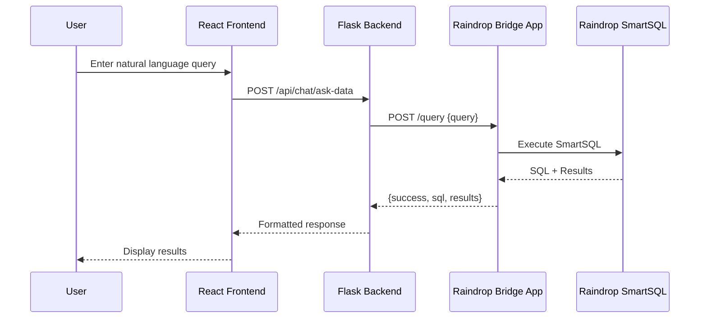
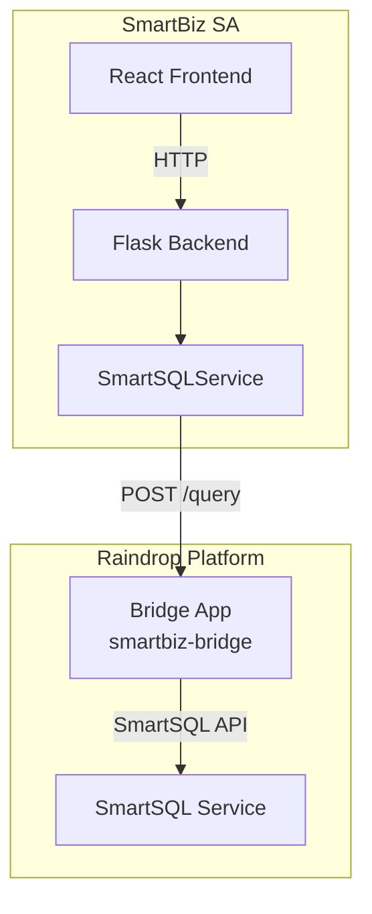

# Design Document: Raindrop SmartSQL Bridge Integration

## Overview

This design describes the integration of Raindrop SmartSQL into the SmartBiz SA Flask backend through a microservice architecture. A "Bridge App" will be created on the Raindrop platform that exposes SmartSQL as an HTTP POST endpoint. The Flask backend's SmartSQLService will be updated to call this Bridge App, enabling the "Ask Data" feature to leverage Raindrop's SmartSQL capabilities.

The architecture follows a simple proxy pattern where the Raindrop Bridge App acts as an intermediary between the Flask backend and Raindrop's SmartSQL service.

## Architecture



### Component Diagram



## Components and Interfaces

### 1. Raindrop Bridge App (smartbiz-bridge)

The Bridge App is a lightweight Raindrop application that exposes a single HTTP endpoint.

#### CLI Commands for Setup

```bash
# Step 1: Install raindrop-code CLI (if not installed)
npm install -g @raindrop/cli

# Step 2: Login to Raindrop
raindrop-code login

# Step 3: Initialize the project
raindrop-code init smartbiz-bridge

# Step 4: Navigate to project
cd smartbiz-bridge

# Step 5: Open the AI agent to build the endpoint
raindrop-code agent
```

#### Natural Language Prompt for Raindrop AI Agent

When the `raindrop-code agent` opens, use this exact prompt:

```
Create an HTTP POST endpoint at /query that:
1. Accepts a JSON body with a "query" field containing a natural language question
2. Passes the query to SmartSQL to convert it to SQL and execute it
3. Returns a JSON response with this structure:
   - On success: {"success": true, "sql": "<generated SQL>", "results": [<array of row objects>]}
   - On error: {"success": false, "error": "<error message>"}
4. Validates that the "query" field exists and is not empty, returning 400 if invalid
5. Handles SmartSQL errors gracefully, returning 500 with error details
6. Adds CORS headers to allow requests from any origin
```

#### Deployment Command

```bash
# Deploy to Raindrop
raindrop-code deploy

# The CLI will output something like:
# ✓ Deployed successfully!
# 🌐 Your app is live at: https://smartbiz-bridge.raindrop.app
```

### 2. Updated SmartSQLService Interface

The Flask SmartSQLService will be updated to support both the new Raindrop Bridge and the legacy LiquidMetal API.

#### Interface Definition

```python
class SmartSQLService:
    """Service for natural language to SQL conversion."""
    
    def __init__(self):
        """Initialize with Raindrop Bridge URL or fallback to LiquidMetal."""
        self.raindrop_url = os.getenv('RAINDROP_BRIDGE_URL')
        self.raindrop_api_key = os.getenv('RAINDROP_API_KEY')
        # Fallback configuration
        self.liquidmetal_api_key = os.getenv('LIQUIDMETAL_API_KEY')
        self.liquidmetal_base_url = os.getenv('LIQUIDMETAL_BASE_URL')
    
    def execute_query(self, natural_language_query: str) -> Dict[str, Any]:
        """Execute a natural language query.
        
        Returns:
            {"success": True, "sql": str, "results": list} on success
            {"success": False, "error": str} on failure
        """
        pass
    
    def _call_raindrop_bridge(self, query: str) -> Dict[str, Any]:
        """Call the Raindrop Bridge App endpoint."""
        pass
    
    def _call_liquidmetal_api(self, query: str) -> Dict[str, Any]:
        """Fallback to LiquidMetal API (existing behavior)."""
        pass
```

### 3. Environment Configuration Interface

New environment variables to add:

| Variable | Description | Required |
|----------|-------------|----------|
| `RAINDROP_BRIDGE_URL` | Full URL to the Bridge App (e.g., `https://smartbiz-bridge.raindrop.app/query`) | Yes (for Raindrop) |
| `RAINDROP_API_KEY` | API key for Bridge App authentication (if required) | Optional |

## Data Models

### Request Format (Flask → Bridge App)

```json
{
  "query": "Show me all invoices from last month"
}
```

### Success Response Format (Bridge App → Flask)

```json
{
  "success": true,
  "sql": "SELECT * FROM invoices WHERE created_at >= '2024-11-01' AND created_at < '2024-12-01'",
  "results": [
    {"id": 1, "amount": 1500.00, "customer": "Acme Corp", "created_at": "2024-11-15"},
    {"id": 2, "amount": 2300.50, "customer": "TechStart", "created_at": "2024-11-20"}
  ]
}
```

### Error Response Format (Bridge App → Flask)

```json
{
  "success": false,
  "error": "Unable to parse query: ambiguous table reference"
}
```


## Correctness Properties

*A property is a characteristic or behavior that should hold true across all valid executions of a system-essentially, a formal statement about what the system should do. Properties serve as the bridge between human-readable specifications and machine-verifiable correctness guarantees.*

### Property 1: URL Routing Based on Configuration

*For any* SmartSQLService instance, if RAINDROP_BRIDGE_URL is configured, the service should route requests to that URL; otherwise, it should fall back to the LiquidMetal API URL.

**Validates: Requirements 4.1, 4.5**

### Property 2: Request Format Consistency

*For any* natural language query string, when the SmartSQLService calls the Raindrop Bridge, the request body should be a valid JSON object containing exactly the "query" field with the original query string.

**Validates: Requirements 4.2**

### Property 3: Response Parsing Consistency

*For any* successful Bridge App response containing {success: true, sql: string, results: array}, the SmartSQLService should return a dictionary with identical structure and values.

**Validates: Requirements 2.5, 4.3**

### Property 4: Error Response Handling

*For any* error response from the Bridge App (HTTP 4xx/5xx or {success: false, error: string}), the SmartSQLService should return {success: false, error: string} without raising exceptions.

**Validates: Requirements 4.4**

### Property 5: Authentication Header Inclusion

*For any* request to the Raindrop Bridge when RAINDROP_API_KEY is configured, the request should include an Authorization header with the API key.

**Validates: Requirements 5.3**

## Error Handling

### SmartSQLService Error Scenarios

| Scenario | HTTP Status | Response | Action |
|----------|-------------|----------|--------|
| Bridge URL not configured, LiquidMetal not configured | N/A | `{"success": false, "error": "SmartSQL not configured"}` | Return error |
| Bridge App unreachable | Connection Error | `{"success": false, "error": "Bridge App connection failed"}` | Return error |
| Bridge App timeout | Timeout | `{"success": false, "error": "Request timed out"}` | Return error |
| Bridge App returns 400 | 400 | `{"success": false, "error": "<message from response>"}` | Parse and return |
| Bridge App returns 500 | 500 | `{"success": false, "error": "<message from response>"}` | Parse and return |
| Invalid JSON response | N/A | `{"success": false, "error": "Invalid response format"}` | Return error |

### Timeout Configuration

- Default timeout: 30 seconds
- Configurable via `RAINDROP_TIMEOUT` environment variable

## Testing Strategy

### Property-Based Testing

The project will use **Hypothesis** (Python) for property-based testing, consistent with the existing test infrastructure.

Each property-based test will:
- Run a minimum of 100 iterations
- Be tagged with the format: `**Feature: raindrop-smartsql-bridge, Property {number}: {property_text}**`
- Reference the specific correctness property being validated

### Unit Tests

Unit tests will cover:
- SmartSQLService initialization with various environment configurations
- Request building for the Raindrop Bridge endpoint
- Response parsing for success and error cases
- Fallback behavior when Raindrop is not configured

### Integration Tests

Integration tests will verify:
- End-to-end flow from Flask route to SmartSQLService
- Actual HTTP calls to a mock Bridge App server
- Error propagation through the service layer

### Test Structure

```
backend/tests/
├── test_smartsql_service.py      # Updated with Raindrop tests
├── test_smartsql_properties.py   # Property-based tests for SmartSQLService
└── conftest.py                   # Shared fixtures
```
