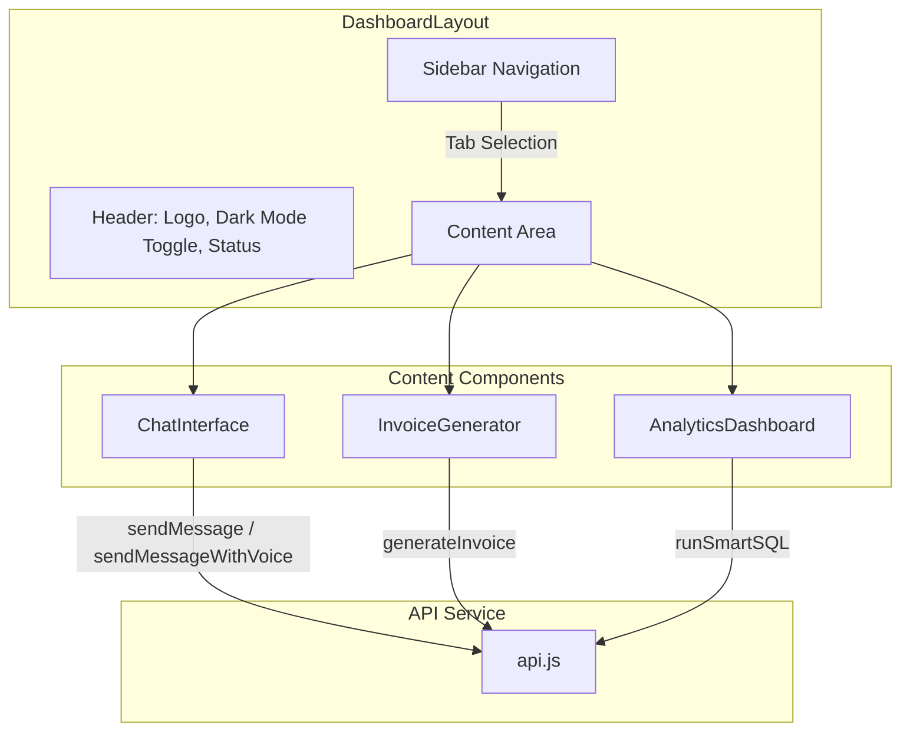

# Design Document: SmartBiz SA Frontend UI Components

## Overview

This design document describes four React components for the SmartBiz SA application: ChatInterface, InvoiceGenerator, AnalyticsDashboard, and DashboardLayout. All components use TailwindCSS for styling, support dark mode, and integrate with the existing `api.js` service layer for backend communication.

## Architecture



## Components and Interfaces

### DashboardLayout.jsx

The main shell component that manages navigation and dark mode state.

```jsx
// Props: none (root component)
// State:
//   - activeTab: 'chat' | 'invoices' | 'analytics'
//   - darkMode: boolean

// Structure:
// - Header (fixed top)
//   - Logo: "SmartBiz SA"
//   - Dark mode toggle (sun/moon icons)
//   - "Connected" status indicator
// - Sidebar (fixed left)
//   - Navigation items: Chat, Invoices, Analytics
// - Main content area
//   - Renders active component based on activeTab
```

### ChatInterface.jsx

ChatGPT-style conversational interface for business advice.

```jsx
// Props:
//   - darkMode: boolean
// State:
//   - messages: Array<{role: 'user' | 'assistant', content: string}>
//   - inputValue: string
//   - isLoading: boolean
//   - voiceMode: boolean

// Methods:
//   - handleSubmit(): Sends message via appropriate API method
//   - playAudio(blob: Blob): Plays audio response using HTML5 Audio
//   - toggleVoiceMode(): Switches between voice and text mode

// Dependencies:
//   - react-markdown: For rendering AI responses with Markdown
//   - api.js: sendMessage, sendMessageWithVoice
```

### InvoiceGenerator.jsx

Form-based interface for creating SARS-compliant tax invoices.

```jsx
// Props:
//   - darkMode: boolean
// State:
//   - clientName: string
//   - vatNumber: string
//   - lineItems: Array<{description: string, quantity: number, unitPrice: number}>
//   - isGenerating: boolean
//   - generatedInvoice: object | null
//   - error: string | null

// Computed:
//   - subtotal: sum of (quantity * unitPrice) for all items
//   - vatAmount: subtotal * 0.15
//   - total: subtotal + vatAmount

// Methods:
//   - addLineItem(): Adds empty line item to array
//   - removeLineItem(index): Removes line item at index
//   - updateLineItem(index, field, value): Updates specific field
//   - handleGenerate(): Calls generateInvoice API
//   - handleDownload(): Mock PDF download

// Dependencies:
//   - api.js: generateInvoice
```

### AnalyticsDashboard.jsx

Business insights dashboard with natural language queries.

```jsx
// Props:
//   - darkMode: boolean
// State:
//   - metrics: {revenue: number, outstanding: number, vatDue: number}
//   - isLoadingMetrics: boolean
//   - query: string
//   - queryResults: Array | null
//   - isQuerying: boolean
//   - error: string | null

// Methods:
//   - loadInitialMetrics(): Called on mount, fetches revenue and outstanding
//   - handleQuerySubmit(): Calls runSmartSQL with user query
//   - renderResults(): Displays results as table or text

// Dependencies:
//   - api.js: runSmartSQL
```

## Data Models

### Message
```typescript
interface Message {
  role: 'user' | 'assistant';
  content: string;
  timestamp?: Date;
}
```

### LineItem
```typescript
interface LineItem {
  description: string;
  quantity: number;
  unitPrice: number;
}
```

### InvoiceFormData
```typescript
interface InvoiceFormData {
  clientName: string;
  vatNumber?: string;
  lineItems: LineItem[];
}
```

### MetricCard
```typescript
interface MetricCard {
  title: string;
  value: string | number;
  icon?: string;
  loading?: boolean;
}
```

## Correctness Properties

*A property is a characteristic or behavior that should hold true across all valid executions of a system-essentially, a formal statement about what the system should do. Properties serve as the bridge between human-readable specifications and machine-verifiable correctness guarantees.*

### Property 1: Message list rendering
*For any* array of messages, the ChatInterface SHALL render all messages in the list, preserving their order and content.
**Validates: Requirements 1.1**

### Property 2: Markdown rendering
*For any* AI response containing Markdown syntax, the ChatInterface SHALL render the content with appropriate HTML formatting.
**Validates: Requirements 1.4**

### Property 3: Voice mode API selection
*For any* message submission, the ChatInterface SHALL call sendMessageWithVoice when voice mode is enabled, and sendMessage when voice mode is disabled.
**Validates: Requirements 1.7, 1.8**

### Property 4: Invoice calculation correctness
*For any* set of line items with valid quantities and unit prices, the InvoiceGenerator SHALL calculate: subtotal = sum of (quantity × unitPrice), VAT = subtotal × 0.15, and total = subtotal + VAT.
**Validates: Requirements 2.7, 2.8, 2.9**

### Property 5: Error message display
*For any* component (ChatInterface, InvoiceGenerator, AnalyticsDashboard) receiving an error response from the API, the component SHALL display the error message to the user.
**Validates: Requirements 1.5, 2.14, 3.7**

### Property 6: Query results rendering
*For any* results array returned from runSmartSQL, the AnalyticsDashboard SHALL render all results in a table or text format.
**Validates: Requirements 3.6**

### Property 7: Navigation state management
*For any* navigation action (clicking a sidebar item), the DashboardLayout SHALL update the active tab state and render the corresponding component.
**Validates: Requirements 4.5, 4.6**

### Property 8: Dark mode styling
*For any* dark mode state, the application SHALL apply the correct CSS classes: slate-900 backgrounds and slate-100 text when enabled, white backgrounds and slate-800 text when disabled.
**Validates: Requirements 5.1, 5.2**

## Error Handling

All components follow a consistent error handling pattern:

1. **API Errors**: Check for `error` property in response, display via alert or inline error message
2. **Loading States**: Show appropriate loading indicators during async operations
3. **Validation Errors**: Prevent form submission with invalid data, show inline validation messages

```jsx
// Error handling pattern for API calls
const handleApiCall = async () => {
  setIsLoading(true);
  setError(null);
  
  try {
    const result = await apiMethod(data);
    if (result.error) {
      setError(result.error);
      return;
    }
    // Handle success
  } catch (err) {
    setError('An unexpected error occurred');
  } finally {
    setIsLoading(false);
  }
};
```

## Testing Strategy

### Dual Testing Approach

Both unit tests and property-based tests will be used:
- **Unit tests**: Verify specific examples, edge cases, and component rendering
- **Property-based tests**: Verify universal properties across many inputs

### Property-Based Testing Library

Using **fast-check** for JavaScript property-based testing, consistent with the existing api.js tests.

### Unit Tests

- Test component rendering with various props
- Test user interactions (clicks, input changes)
- Test loading and error states
- Test API integration with mocked responses

### Property-Based Tests

Each property-based test will:
- Run a minimum of 100 iterations
- Be tagged with format: `**Feature: smartbiz-frontend-ui, Property {number}: {property_text}**`

**Property 1**: Generate arrays of messages and verify all are rendered
**Property 2**: Generate Markdown strings and verify HTML output contains expected elements
**Property 3**: Generate boolean voice mode states and messages, verify correct API is called
**Property 4**: Generate arrays of line items with random quantities/prices, verify calculation correctness
**Property 5**: Generate error responses and verify error display
**Property 6**: Generate result arrays and verify all are rendered
**Property 7**: Generate navigation actions and verify state updates
**Property 8**: Generate dark mode states and verify CSS class application

