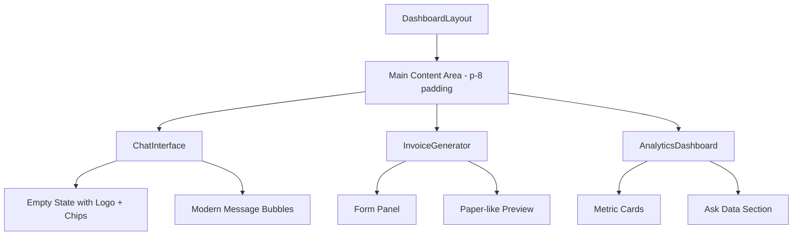

# Design Document: UI Polish for SaaS Appearance

## Overview

This design document outlines the implementation approach for polishing the SmartBiz SA frontend UI to achieve a high-end SaaS product appearance. The changes focus on visual enhancements using Tailwind CSS while preserving all existing functionality and API integrations.

The key improvements include:
- Enhanced spacing in the main content area
- Consistent premium card styling across all components
- Modern chat interface with empty state and suggestion chips
- Contemporary message bubble styling
- Paper-like invoice preview appearance
- Cohesive metric card styling in the Analytics Dashboard

## Architecture

The UI polish changes follow the existing component architecture without introducing new structural patterns. All modifications are CSS/styling changes within the existing React components.



## Components and Interfaces

### DashboardLayout Changes

**Main Content Area Padding:**
- Add `p-8` class to the main content wrapper
- Ensures consistent spacing across all tab views

```jsx
<main className={`flex-1 ml-64 p-8 ${darkMode ? 'bg-slate-800' : 'bg-slate-50'}`}>
```

### Card Styling Standard

All cards throughout the application will follow this consistent styling pattern:

| Property | Light Mode | Dark Mode |
|----------|------------|-----------|
| Background | `bg-white` | `bg-slate-800` |
| Shadow | `shadow-lg` | `shadow-lg` |
| Border Radius | `rounded-xl` | `rounded-xl` |
| Border | `border border-slate-200` | `border border-slate-700` |

**Reusable Card Classes:**
```
Light: bg-white shadow-lg rounded-xl border border-slate-200
Dark: bg-slate-800 shadow-lg rounded-xl border border-slate-700
```

### ChatInterface Changes

**Empty State Component:**
- Displays when `messages.length === 0`
- Centers the Logo component vertically
- Shows 3 suggestion chips below the logo
- Chips are clickable and submit the suggestion as a message

**Suggestion Chips:**
```jsx
const suggestions = [
  "How do I register for VAT?",
  "Draft a payment reminder",
  "Analyze my revenue"
];
```

**Chip Styling:**
- Rounded pill shape (`rounded-full`)
- Subtle background with hover effect
- Transition animations for polish

**Message Bubble Styling:**
- User messages: `rounded-2xl` with blue background, subtle shadow
- Assistant messages: `rounded-2xl` with appropriate background per mode
- Both: `shadow-sm` and `transition-all` for smooth interactions

### InvoiceGenerator Changes

**Live Preview Panel - Paper Effect:**
- Always white background (`bg-white`) regardless of dark mode
- Large shadow (`shadow-2xl`) for paper depth
- Centered with `mx-auto` and max-width constraint
- Subtle border (`border border-slate-200`)
- Rounded corners (`rounded-xl`)

```jsx
<div className="bg-white shadow-2xl rounded-xl border border-slate-200 mx-auto max-w-2xl p-8">
```

### AnalyticsDashboard Changes

**Metric Cards:**
- Apply standard card styling pattern
- Consistent with other cards in the application

**Ask Data Section:**
- Apply standard card styling pattern
- Maintains visual consistency with metric cards

## Data Models

No data model changes required. This feature is purely visual/styling.

## Correctness Properties

*A property is a characteristic or behavior that should hold true across all valid executions of a system-essentially, a formal statement about what the system should do. Properties serve as the bridge between human-readable specifications and machine-verifiable correctness guarantees.*

Since all acceptance criteria for this UI polish feature are example-based tests (verifying specific CSS classes are applied in specific scenarios), there are no universal properties that apply across all inputs. The testing strategy will focus on example-based unit tests that verify:

1. Correct CSS classes are applied based on dark mode state
2. Empty state renders correctly when no messages exist
3. Suggestion chips contain the correct text and are clickable
4. Invoice preview maintains white background in both modes

**No testable properties identified** - All criteria are specific examples of CSS class application rather than universal properties that hold across all inputs.

## Error Handling

No new error handling required. Existing error handling in components remains unchanged.

## Testing Strategy

### Testing Framework
- Vitest for unit testing
- React Testing Library for component testing

### Unit Tests

The following example-based tests will verify the UI polish implementation:

**DashboardLayout Tests:**
- Verify main content area has `p-8` padding class
- Verify padding is consistent across all tab views

**Card Styling Tests:**
- Verify cards have `shadow-lg` class
- Verify cards have `rounded-xl` class
- Verify light mode cards have `bg-white` and `border-slate-200`
- Verify dark mode cards have `bg-slate-800` and `border-slate-700`

**ChatInterface Tests:**
- Verify empty state shows Logo when no messages
- Verify exactly 3 suggestion chips are rendered
- Verify suggestion chips contain correct text
- Verify clicking a chip submits the message
- Verify message bubbles have `rounded-2xl` class

**InvoiceGenerator Tests:**
- Verify preview panel has `bg-white` in light mode
- Verify preview panel has `bg-white` in dark mode (always white)
- Verify preview panel has `shadow-2xl` class
- Verify preview panel is centered with `mx-auto`

**AnalyticsDashboard Tests:**
- Verify metric cards have standard card styling
- Verify Ask Data section has standard card styling

### Test Annotations
All tests will be annotated with the requirement they validate using the format:
`**Validates: Requirements X.Y**`
