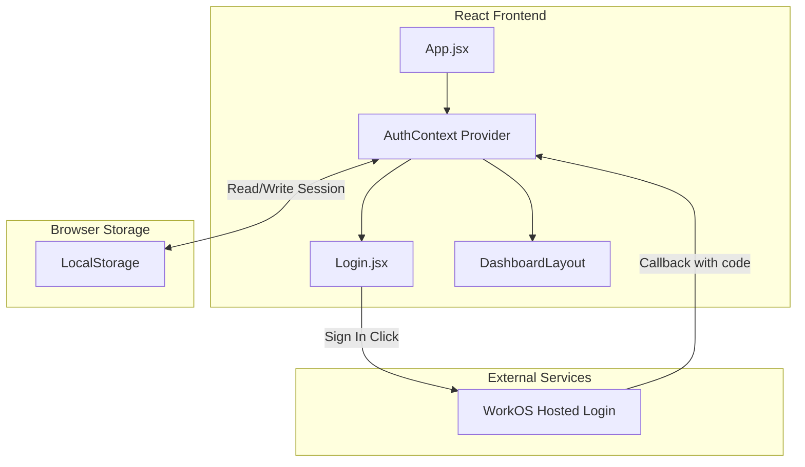

# Design Document: WorkOS Authentication Login

## Overview

This design implements WorkOS Hosted Login authentication for the SmartBiz React frontend. The solution uses React Context for state management, LocalStorage for session persistence, and integrates with WorkOS's OAuth 2.0 flow. The implementation is intentionally simple for demo purposes, focusing on the core authentication flow without complex token management.

## Architecture



## Components and Interfaces

### 1. AuthContext.jsx

The central authentication context that manages auth state and provides authentication methods.

```javascript
// Context shape
{
  isAuthenticated: boolean,
  user: { code: string } | null,
  login: () => void,        // Redirects to WorkOS
  logout: () => void,       // Clears session
  handleCallback: (code: string) => void  // Processes OAuth callback
}
```

**Responsibilities:**
- Initialize auth state from LocalStorage on mount
- Construct and redirect to WorkOS login URL
- Handle OAuth callback and store session
- Provide logout functionality
- Expose auth state to child components

### 2. Login.jsx

A simple login page component displayed to unauthenticated users.

```javascript
// Props: none (uses AuthContext)
// Renders: Logo, Sign In button, optional error message
```

**Responsibilities:**
- Display application branding/logo
- Render "Sign In" button that triggers login flow
- Display error messages from failed auth attempts
- Handle OAuth callback URL parameters

### 3. App.jsx (Modified)

Updated to wrap the application with AuthProvider and conditionally render Login or Dashboard.

```javascript
// Conditional rendering based on isAuthenticated
{isAuthenticated ? <Dashboard /> : <Login />}
```

## Data Models

### Session Data (LocalStorage)

```javascript
// Key: 'smartbiz_auth_session'
{
  code: string,           // Authorization code from WorkOS
  timestamp: number       // When session was created (for potential expiry)
}
```

### Environment Variables

```
VITE_WORKOS_CLIENT_ID=<your-workos-client-id>
VITE_WORKOS_REDIRECT_URI=<your-redirect-uri>
```

## Correctness Properties

*A property is a characteristic or behavior that should hold true across all valid executions of a system-essentially, a formal statement about what the system should do. Properties serve as the bridge between human-readable specifications and machine-verifiable correctness guarantees.*

### Property 1: Authentication state determines view
*For any* authentication state (authenticated or unauthenticated), the application SHALL render the Dashboard when authenticated and the Login page when unauthenticated.
**Validates: Requirements 1.1, 6.1, 6.2**

### Property 2: WorkOS URL construction
*For any* valid client ID and redirect URI, the constructed WorkOS login URL SHALL contain both parameters correctly encoded.
**Validates: Requirements 1.3, 5.3**

### Property 3: Authorization code extraction
*For any* callback URL containing a `code` query parameter, the system SHALL correctly extract the authorization code value.
**Validates: Requirements 2.1**

### Property 4: Session persistence round-trip
*For any* valid session data stored in LocalStorage, reloading the application SHALL restore the same authenticated state.
**Validates: Requirements 2.2, 3.1**

### Property 5: Error parameter handling
*For any* callback URL containing an `error` query parameter, the system SHALL remain unauthenticated and display the error.
**Validates: Requirements 2.4**

### Property 6: Logout clears session
*For any* authenticated session, calling logout SHALL clear LocalStorage and reset authentication state to unauthenticated.
**Validates: Requirements 4.1, 4.3**

## Error Handling

| Error Scenario | Handling Strategy |
|----------------|-------------------|
| Missing environment variables | Log warning, disable login button |
| OAuth callback error | Display error message on login page |
| LocalStorage unavailable | Fall back to in-memory state (no persistence) |
| Invalid/corrupted session data | Clear session, show login page |

## Testing Strategy

### Unit Testing

Unit tests will be written using Vitest and React Testing Library to verify:
- Login component renders correctly with Sign In button
- AuthContext provides expected values and methods
- Conditional rendering based on auth state
- URL construction with various inputs

### Property-Based Testing

Property-based tests will use fast-check library to verify:
- URL construction produces valid URLs for any valid inputs
- Session round-trip preserves data integrity
- Auth state correctly determines rendered view
- Logout always results in unauthenticated state

**Testing Framework:** Vitest with fast-check for property-based testing

**Test Configuration:**
- Minimum 100 iterations per property test
- Tests tagged with format: `**Feature: workos-auth-login, Property {number}: {property_text}**`
